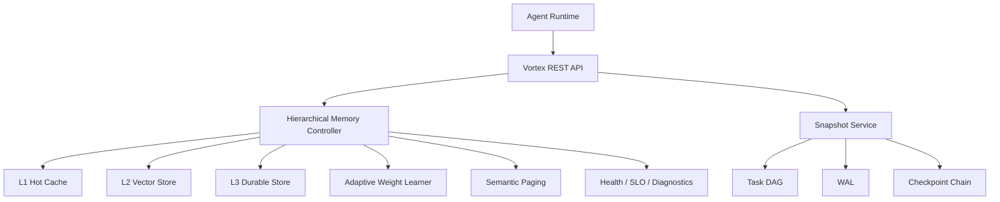

# Vortex

Vortex 是一个面向长时运行 AI Agent 的记忆与状态管理内核。它围绕 Agent 在任务执行中产生的事实、偏好、工具结果、任务状态和 checkpoint，提供分级记忆、语义召回、语义淘汰、任务 DAG、checkpoint/recovery 和可观测治理能力。

本仓库是 **公开展示版**，用于简历、技术评审和面试沟通。完整实现仍保留在私有仓库中；这里不会公开完整源码、模型权重、原始评测报告、私有环境信息或可直接商业化复刻的全部实现细节。

## 项目亮点

- 设计 AI Agent 三层记忆内核：L1 热缓存、L2 向量召回、L3 持久化冷存储。
- 支持语义召回、namespace/tag 过滤、token budget、基于反馈的自适应排序、pin/unpin 和语义淘汰。
- 实现任务状态管理能力：Task DAG、WAL、FULL/DELTA checkpoint、branch、merge、recover、Graphviz DOT export。
- 引入语义分页和预取，用于长任务上下文的分页加载和预测性恢复。
- 建立真实 LLM memory eval 与无模型 governance：v3.1 strict workload 的 accepted result 可复验为 `0/20 -> 20/20 -> 20/20`。
- 提供 health catalog、SLO snapshot、diagnostic signals、Prometheus-oriented metrics 和 runbook 化排障思路。

## 当前展示边界

| 内容 | 是否公开 | 说明 |
| --- | --- | --- |
| 架构设计 | 是 | 展示模块边界、数据流和核心决策 |
| API 形态 | 是 | 展示 memory/task/health API 的外部契约 |
| 评测摘要 | 是 | 只保留脱敏后的结果表和解释 |
| 概念性代码片段 | 是 | 只放缩短后的 redacted excerpts |
| 完整源码 | 否 | 保留在私有仓库 |
| 原始 eval reports | 否 | 原始报告含环境元数据，不公开 |
| 私有服务 URL / API key / 本机路径 | 否 | 已从展示版排除 |
| 模型权重和第三方资产 | 否 | 展示版不分发这些资产 |

## 已验证结论

Vortex 当前最有代表性的证据来自 v3.1 real-agent workload strict audit。该 workload 模拟长任务 Agent 场景下的记忆召回、状态延续、旧信息干扰、多片段合成和 L1 eviction 后恢复。

| 模式 | 结果 | 含义 |
| --- | --- | --- |
| `Baseline-NoMemory` | `0/20` | 不提供长期记忆时，模型无法回答受控问题 |
| `Vortex-Memory` | `20/20` | 接入 Vortex 记忆召回后全部答对 |
| `Vortex-RecoveredMemory` | `20/20` | 压低 L1 容量并触发 lower-tier recovery 后仍全部答对 |

该结论证明的是：**在受控真实 LLM memory workload 下，Vortex 的记忆召回与恢复路径能显著改善长任务 Agent 的回答正确性。**

它不等价于生产级多租户平台已经完成，也不声称已经完成长期高并发、权限系统、计费系统或完整 Agent runtime 产品化。

## 架构概览



## 模块职责

| 模块 | 职责 |
| --- | --- |
| `vortex-app` | REST API、OpenAPI、Actuator、health、eval CLI、集成测试 |
| `vortex-kernel` | HMC、召回、淘汰、学习、SLO、generation adapter、snapshot、paging |
| `vortex-storage` | L1/L2/L3 存储适配器 |
| `vortex-common` | model、DTO、serialization、exception、health contracts |

展示版只公开模块职责和关键设计，完整实现不在本仓库。

## 核心能力

### 1. 三层分级记忆

| 层级 | 作用 |
| --- | --- |
| L1 Hot | 热记忆缓存，负责低延迟读写和 token capacity 管理 |
| L2 Warm | 向量检索层，负责语义召回和 L1 eviction 后恢复 |
| L3 Cold | 持久化层，负责 fragment 冷存储、checkpoint 和 durable artifacts |

写入路径：

```text
raw text -> semantic split -> embedding -> L1 admit -> async L2/L3 persistence
```

召回路径：

```text
query -> L1 semantic ranking -> tag/namespace filter -> token budget -> L2 fallback -> L3 enrichment -> L1 re-admission
```

### 2. 语义召回与反馈学习

召回结果会记录 `recallSessionId`，后续 feedback 用于更新 adaptive ranking：

```text
recall -> answer -> feedback -> active/shadow/baseline comparison -> profile update
```

这种设计用于解决不同 Agent 场景下排序偏好不同的问题。例如 coding、chat、search 任务对 recency、similarity、importance 的权重并不相同。

### 3. 语义淘汰

Vortex 使用 semantic-LRU 风格的淘汰策略，而不是简单 LRU：

```text
score = alpha * recency + beta * similarity + gamma * importance
```

实际设计还考虑：

- reasoning chain 分组，避免拆散推理链上下文。
- redundancy penalty 和 novelty bonus。
- pinned fragment 保护。
- namespace quota。
- eviction regret 追踪。
- SLO/diagnostic signal 输出。

### 4. 任务 DAG 与 checkpoint/recovery

任务状态管理遵循：

```text
validate-before-WAL
WAL-before-state
FULL checkpoint -> DELTA chain -> WAL replay
```

支持能力：

- task create/list/get/complete/fail/delete
- DAG node append/complete/delete
- edge mutation
- context update
- checkpoint and recover
- branch create/switch/merge
- Graphviz DOT export

### 5. 语义分页与预取

长任务 Agent 可能产生大量 fragments。Vortex 使用 semantic page 组织记忆，并支持：

- page fault 时整页加载回 L1。
- DAG topology prefetch。
- semantic neighborhood prefetch。
- branch speculative prefetch。
- strategy hit-rate 观测与调节。

### 6. 观测与治理

Vortex 不只输出异常日志，还会输出 typed diagnostic signals。观测面包括：

- health status
- health catalog
- SLO snapshot
- diagnostic report
- persistence / recovery / paging / learning signals
- Prometheus-oriented metrics

## API 形态

### Memory API（记忆接口）

```text
POST   /api/v1/memory/store
POST   /api/v1/memory/store/fragment
GET    /api/v1/memory/fragment/{fragmentId}
DELETE /api/v1/memory/fragment/{fragmentId}
POST   /api/v1/memory/recall
POST   /api/v1/memory/feedback
POST   /api/v1/memory/pin
POST   /api/v1/memory/unpin
GET    /api/v1/memory/health
GET    /api/v1/memory/health/catalog
GET    /api/v1/memory/slo
GET    /api/v1/memory/slo/report
GET    /api/v1/memory/learning
```

示例：

```http
POST /api/v1/memory/recall
Content-Type: application/json

{
  "query": "Which deployment validation should be used?",
  "namespace": "agent-session-1",
  "topK": 5,
  "tokenBudget": 1024,
  "tags": ["deployment"],
  "scenario": "coding"
}
```

### Task API（任务接口）

```text
POST   /api/v1/tasks
GET    /api/v1/tasks
GET    /api/v1/tasks/{taskId}
POST   /api/v1/tasks/{taskId}/complete
POST   /api/v1/tasks/{taskId}/fail
DELETE /api/v1/tasks/{taskId}
POST   /api/v1/tasks/{taskId}/nodes
POST   /api/v1/tasks/{taskId}/nodes/complete
DELETE /api/v1/tasks/{taskId}/nodes/{nodeId}
POST   /api/v1/tasks/{taskId}/nodes/edge
PUT    /api/v1/tasks/{taskId}/context
POST   /api/v1/tasks/{taskId}/checkpoint
GET    /api/v1/tasks/{taskId}/checkpoints
POST   /api/v1/tasks/{taskId}/recover
GET    /api/v1/tasks/{taskId}/branches
POST   /api/v1/tasks/{taskId}/branch
POST   /api/v1/tasks/{taskId}/branch/switch
POST   /api/v1/tasks/{taskId}/merge
GET    /api/v1/tasks/{taskId}/dag
```

更多示例见：

- [docs/api-overview.md](docs/api-overview.md)
- [examples/memory-api.http](examples/memory-api.http)
- [examples/task-api.http](examples/task-api.http)

## 技术栈

私有完整实现使用：

- Java 21
- Spring Boot
- Caffeine
- Milvus
- MinIO
- Kryo
- DJL / ONNX Runtime
- Testcontainers
- Micrometer / Prometheus

展示版不分发第三方模型文件和完整运行环境。

## 设计取舍

完整说明见 [docs/design-decisions.md](docs/design-decisions.md)。核心取舍包括：

- 为什么 memory 需要 L1/L2/L3 三层，而不是单层缓存。
- 为什么淘汰策略需要语义、重要性和 regret，而不是普通 LRU。
- 为什么任务状态需要 WAL-before-state。
- 为什么公开仓库只展示架构与片段，不公开完整实现。

## 脱敏代码片段

`snippets/` 中是缩短后的概念片段，仅用于技术评审：

- [HierarchicalMemoryController.excerpt.java](snippets/HierarchicalMemoryController.excerpt.java)
- [RecallOrchestrator.excerpt.java](snippets/RecallOrchestrator.excerpt.java)
- [SnapshotService.excerpt.java](snippets/SnapshotService.excerpt.java)

这些片段不能用于复刻完整实现。

## 当前边界

已展示：

- 架构
- API 形态
- 核心设计
- 评测结论摘要
- 少量脱敏代码片段

未展示：

- 完整源码
- 完整 eval harness
- 原始报告
- 私有环境配置
- 模型文件
- 商业化部署细节

## 许可

本仓库仅用于作品集展示和技术评审。未经书面许可，不得复制、转售、再分发、商用托管或创建商业衍生作品。见 [LICENSE](LICENSE)。
