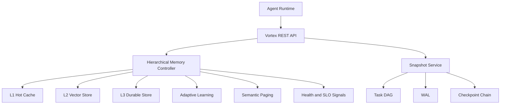

# Vortex

AI Agent memory and state management kernel.

This repository is a **public technical showcase**. The full implementation is kept private. The materials here are intentionally redacted: they show the architecture, API shape, evaluation results, and selected design excerpts without exposing the full commercial implementation.

## Highlights

- Three-tier Agent memory: L1 hot cache, L2 vector recall, L3 durable storage.
- Semantic recall with namespace/tag filtering, token budget, recovery, and feedback.
- Task state management with DAG, WAL, FULL/DELTA checkpoints, branch, merge, and recovery.
- Semantic paging and prefetch for long-running Agent workloads.
- Real LLM memory evaluation: `Baseline-NoMemory = 0/20`, `Vortex-Memory = 20/20`, `Vortex-RecoveredMemory = 20/20` across the accepted v3.1 strict audit.
- Governance-oriented engineering: repeatable fixture verification, health signals, SLO snapshots, and runbook-driven diagnostics.

## What Is Public Here

```text
README.md
docs/architecture.md
docs/eval-summary.md
docs/api-overview.md
docs/design-decisions.md
examples/*.http
snippets/*.java
```

## What Is Not Public

- Full source code.
- Production-ready implementation details.
- Raw evaluation reports with environment metadata.
- Private provider URLs, API keys, local paths, model weights, or internal scripts.
- Third-party model artifacts.

## System Overview



## Core Capabilities

| Area | Capability |
| --- | --- |
| Memory | Store raw Agent context, split into fragments, embed, recall, recover, delete, pin/unpin |
| Retrieval | L1 ranking first, L2 fallback, namespace/tag filtering, token budget enforcement |
| Learning | Feedback-driven adaptive ranking with active/shadow/baseline comparison |
| Eviction | Semantic-LRU style scoring with recency, similarity, importance, regret, and pin protection |
| State | Task DAG, WAL, checkpoint, recover, branch, merge, DOT export |
| Paging | Semantic pages, page fault handling, DAG-aware and branch-aware prefetch |
| Observability | Health catalog, SLO snapshots, diagnostic signals, Prometheus-oriented metrics |
| Governance | Deterministic fixture replay and strict eval profile verification |

## Evaluation Summary

The accepted v3.1 real-agent workload strict audit validates the memory/recovery behavior under a controlled real LLM workload.

| Mode | Result |
| --- | --- |
| Baseline-NoMemory | `0/20` |
| Vortex-Memory | `20/20` |
| Vortex-RecoveredMemory | `20/20` |

The recovered mode intentionally constrains L1 capacity so the system must rely on lower-tier recovery. Details are summarized in [docs/eval-summary.md](docs/eval-summary.md).

## API Shape

Memory APIs:

```text
POST   /api/v1/memory/store
POST   /api/v1/memory/recall
POST   /api/v1/memory/feedback
POST   /api/v1/memory/pin
POST   /api/v1/memory/unpin
GET    /api/v1/memory/health
GET    /api/v1/memory/slo/report
```

Task APIs:

```text
POST   /api/v1/tasks
POST   /api/v1/tasks/{taskId}/nodes
POST   /api/v1/tasks/{taskId}/checkpoint
POST   /api/v1/tasks/{taskId}/recover
POST   /api/v1/tasks/{taskId}/branch
POST   /api/v1/tasks/{taskId}/merge
GET    /api/v1/tasks/{taskId}/dag
```

See [docs/api-overview.md](docs/api-overview.md) and [examples](examples/).

## Selected Design Excerpts

The `snippets/` directory contains intentionally shortened, non-complete excerpts. They are for technical review only and are not sufficient to recreate the private implementation.

## Repository Status

This showcase is suitable for resume and technical interview review. It is not an open-source distribution of the full project.

## License

All rights reserved. See [LICENSE](LICENSE).

