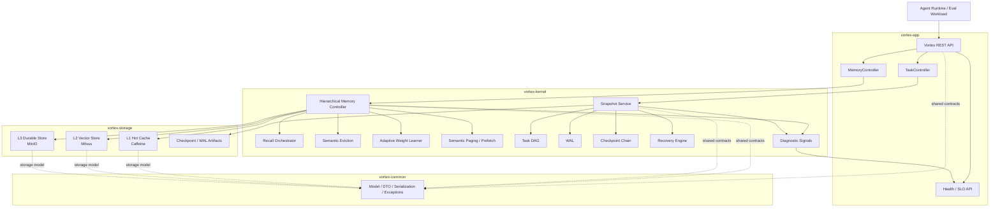

# Vortex

Vortex 是一个面向长时运行 AI Agent 的记忆与状态管理内核。它把 Agent 运行中产生的事实、偏好、工具结果、任务状态和 checkpoint 组织成可召回、可淘汰、可恢复、可观测的分级记忆系统。

本仓库是 **公开展示版**，用于简历、技术评审和面试沟通。完整实现仍保留在私有仓库中；这里不会公开完整源码、原始评测报告、私有环境配置、模型权重、内部脚本或可直接商业化复刻的全部实现细节。

更准确地说，Vortex 当前是：

```text
已通过真实 LLM 长任务 Agent memory workload 验证的分级记忆与状态管理内核。
```

它不是完整的多租户 SaaS，也不是通用 Agent 执行框架。项目重点是 memory kernel、task state kernel、eval/governance harness 三部分：把长期上下文写入分级存储，在 L1 token pressure 下从 L2 恢复，并用真实模型评测证明记忆是否真的被模型使用。

## 项目亮点

- 设计 AI Agent 三层记忆内核：L1 热缓存、L2 向量召回、L3 持久化冷存储。
- 支持语义召回、namespace/tag 过滤、token budget、基于反馈的自适应排序、pin/unpin 和语义淘汰。
- 实现任务状态管理能力：Task DAG、WAL、FULL/DELTA checkpoint、branch、merge、recover、Graphviz DOT export。
- 引入语义分页和预取，用于长任务上下文的分页加载和预测性恢复。
- 建立真实 LLM memory eval 与无模型 governance：v3.1 strict workload 的 accepted result 可复验为 `0/20 -> 20/20 -> 20/20`。
- 提供 health catalog、SLO snapshot、diagnostic signals、Prometheus-oriented metrics 和 runbook 化排障思路。

## 当前结论

当前最强的已验证结论来自 v3.1 real-agent workload official strict audit：

| 项 | 当前值 |
| --- | --- |
| Profile | `official-v3.1-real-agent-workload-strict` |
| Dataset version | `v3.1-real-agent-workload` |
| Case count | 20 |
| Modes | `Baseline-NoMemory`, `Vortex-Memory`, `Vortex-RecoveredMemory` |
| L1 audit capacity | `96` tokens |
| Result | 3/3 轮通过；`Baseline-NoMemory = 0/20`，`Vortex-Memory = 20/20`，`Vortex-RecoveredMemory = 20/20` |
| Recovery signal | `RecoveredL2HitRate = 1.0` in all 3 rounds |

这个结论说明：在受控的真实 LLM 长任务记忆评测中，接入 Vortex 后模型可以找回并使用长期上下文；在压低 L1 容量、强制触发 L2 recovery 的场景下也能保持正确。

边界也要明确：这证明的是“受控 workload 下的真实模型记忆增强能力”，不是生产级多租户、安全、长期高并发平台已经完成。

## 当前展示边界

| 内容 | 是否公开 | 说明 |
| --- | --- | --- |
| 架构设计 | 是 | 展示模块边界、数据流和核心决策 |
| API 形态 | 是 | 展示 memory/task/health API 的外部契约 |
| 评测摘要 | 是 | 只保留脱敏后的结果表和解释 |
| 证据索引 | 是 | 展示能力与模块/设计之间的对应关系 |
| 概念性代码片段 | 是 | 只放缩短后的 redacted excerpts |
| 完整源码 | 否 | 保留在私有仓库 |
| 原始 eval reports | 否 | 原始报告含环境元数据，不公开 |
| 私有服务 URL / API key / 本机路径 | 否 | 已从展示版排除 |
| 模型权重和第三方资产 | 否 | 展示版不分发这些资产 |
| 内部脚本和部署配置 | 否 | 不公开可直接复刻部署的操作细节 |

## 证据索引

| 主张 | 代码 / 证据类型 |
| --- | --- |
| 三层记忆写入与 L1 admission | `HierarchicalMemoryController`, `TieredEvictionCoordinator` |
| 异步 L2/L3 持久化、幂等与 DLQ | `FragmentPersistenceManager`, `FragmentPersistenceTask`, file-backed task store |
| L1 语义召回、L2 recovery、feedback session | `RecallOrchestrator`, `AdaptiveWeightLearner`, `RecallSessionRecord` |
| semantic-LRU 淘汰、分组淘汰、pin 保护 | `SemanticEvictionPolicy`, `TieredEvictionCoordinator`, `FragmentPinManager` |
| task DAG / WAL / checkpoint / branch / recover | `SnapshotService`, `DagMutationService`, `RecoveryEngine`, `BranchManager` |
| semantic paging / prefetch | `SemanticPagingManager`, `SemanticPageTable`, `PrefetchEngine` |
| health / SLO / diagnostic signal | `MemorySloHealthIndicator`, `MemoryDiagnosticsCollector`, `MemoryHealthSignalCatalog` |
| 真实 LLM memory eval 与 fixture replay | `LlmMemoryEvalRunner`, baseline verifier, accepted audit summary |
| 测试覆盖面 | 私有仓库包含单元测试、集成测试和治理门禁 |

展示版只公开证据索引和少量脱敏片段，不公开完整类实现、原始 fixture、报告元数据或内部运行脚本。

## 架构概览



主路径分为两条：memory kernel 负责写入、召回、淘汰、学习、分页和 L2 recovery；task state kernel 负责 DAG、WAL、checkpoint、branch 和 recover。两条路径共享 health/SLO/diagnostic signal，并通过 `vortex-common` 复用外部契约和序列化模型。

## 模块职责

| 模块 | 职责 |
| --- | --- |
| `vortex-app` | REST API、OpenAPI、Actuator、health、eval CLI、集成测试 |
| `vortex-kernel` | HMC、召回、淘汰、学习、SLO、generation adapter、snapshot、paging |
| `vortex-storage` | L1/L2/L3 存储适配器 |
| `vortex-common` | model、DTO、serialization、exception、health contracts |

展示版只公开模块职责和关键设计，完整实现不在本仓库。

## 核心能力

### 1. 三层分级记忆

| 层级 | 典型实现 | 作用 |
| --- | --- | --- |
| L1 Hot | Caffeine | 热记忆缓存、token capacity 管理、低延迟读写 |
| L2 Warm | Milvus | 向量检索、namespace 过滤、L1 eviction 后的语义恢复 |
| L3 Cold | MinIO | fragment 冷存档、checkpoint/WAL 相关持久化、page table 持久化 |

写入路径由 `HierarchicalMemoryController` 驱动：

```text
raw text -> semantic split -> embedding -> L1 admit -> async L2/L3 persistence
```

召回路径由 `RecallOrchestrator` 驱动：

```text
query -> L1 semantic ranking -> tag/namespace filter -> token budget -> L2 fallback -> L3 enrichment -> L1 re-admission
```

Embedding 路径是显式分层的：L1 默认使用本地 embedding；L2 可选使用 cloud embedding，未启用时可复用 L1 embedding。向量维度迁移需要显式确认，避免误删已有 collection。

### 2. 语义召回与反馈学习

召回支持 namespace、required tags、`topK`、`tokenBudget` 和 `scenario`。L1 不足时查 L2；若向量召回不足，还有 namespace fallback。L2 命中后补全 fragment，重新 admit 回 L1，并触发持久化/访问记录。

每次召回生成 `recallSessionId`，后续 `/feedback` 会驱动 `AdaptiveWeightLearner`：

```text
recall -> answer -> feedback -> active/shadow/baseline comparison -> profile update
```

`AdaptiveWeightLearner` 不只是修改一个静态参数。它记录 active / shadow / baseline ranking，使用 feedback、regret、selection precision/coverage、nDCG-like ranking reward 等信号更新不同场景的权重 profile。

当前公开的场景形态：

```text
CHAT
CODING
SEARCH
```

### 3. 语义淘汰

L1 淘汰不是简单 LRU，而是 semantic-LRU 变体：

```text
score = alpha * recency + beta * similarity + gamma * importance
```

低分优先淘汰。实际设计还包括：

- `reasoningChainId` 分组淘汰，避免只淘汰推理链中的单个关键片段。
- redundancy penalty / novelty bonus，降低重复片段保留优先级。
- pinned fragment 保护，pin 过期会在 admission/eviction 前清理。
- namespace quota，优先在本 namespace 内回收，必要时处理跨 namespace 借用。
- regret-aware ordering，避免反复淘汰近期被证明有用的 fragment。
- eviction decision log、regret rate、tiered selection 进入 SLO/diagnostics。

### 4. 任务 DAG、checkpoint 与恢复

`SnapshotService` 是任务状态门面，覆盖：

- task lifecycle：create/list/get/complete/fail/delete
- DAG node/edge mutation
- task context upsert/delete
- FULL/DELTA checkpoint
- WAL replay
- branch create/switch/merge
- Graphviz DOT export

关键语义：

```text
validate-before-WAL
WAL-before-state
FULL -> DELTA... -> WAL replay
```

恢复路径由 `RecoveryEngine` 处理：先解析目标 checkpoint 或最新 durable state，再 replay checkpoint 之后的 WAL。终态任务会尝试 final checkpoint；删除任务会先记录 durable delete intent，再清理 WAL/checkpoint artifacts。

### 5. 语义分页与预取

语义分页用于长任务 Agent 的大量 fragments 管理：

- page table 持久化。
- 基于 embedding 的聚类或增量分配组织 `SemanticPage`。
- page fault 时整页加载回 L1。
- 预取策略包括 DAG topology、semantic neighborhood、branch speculative。
- 预取策略会记录命中率，并参与诊断。

### 6. 观测、SLO 与治理

Vortex 不只输出异常日志，还会输出 typed diagnostic signals。观测面包括：

- health status
- health catalog
- SLO snapshot
- diagnostic report
- persistence / recovery / paging / learning signals
- Prometheus-oriented metrics

`/api/v1/memory/health` 返回 `status`、`summary`、`statusReason`、`details`、L1 token 使用量等信息。`UP` 和 `DEGRADED` 返回 HTTP 200；`DOWN` 返回 HTTP 503。

## Eval Workload

v3.1 workload 不是只验证“答案里有没有关键词”的单点测试。它包含 20 个长任务 Agent 记忆场景，每个 case 由多条 memory fragments、expected fragments、must contain、must not contain、failure categories 和 tags 组成。

覆盖的主要失败模式包括：

- 多步 current-state overwrite，避免回答旧 owner / 旧计划。
- namespace collision，同名实体在不同 namespace 下含义不同。
- branch-specific final decision，避免拿未采纳分支作为最终方案。
- checkpoint continuation，恢复后继续下一步而不是重复已完成动作。
- tool policy / safety-sensitive recall，避免使用旧的高风险工具策略。
- preference reversal，识别用户当前偏好而不是历史偏好。
- long-context distractor，与当前事实相似但已经过期的干扰项。
- multi-fragment synthesis，单个 fragment 不足以推出最终答案。

`Vortex-RecoveredMemory` 模式会在 store 后等待目标 fragment 可恢复，然后强制制造 L1 pressure，让答案所需 fragment 离开 L1，再要求 recall 从 L2 找回。official audit 使用低 L1 token capacity、3 轮真实 LLM 运行、每轮 20 cases，并用 strict verifier 检查 dataset、model、base URL、prompt SHA、modes、L1 容量和 mode summaries 是否漂移。

评测仍有边界：答案正确性由规则化 answer judge 根据 `mustContain` / `mustNotContain` 等契约判断，不是人工主观评审；workload 是面向 memory recovery 能力的受控集合，不等价于开放世界 Agent benchmark。

## API 形态

### Memory API（记忆接口）

| 方法 | 路径 | 说明 |
| --- | --- | --- |
| `POST` | `/api/v1/memory/store` | 存储原始文本，自动分片、嵌入、写入三层记忆 |
| `POST` | `/api/v1/memory/store/fragment` | 写入预构造 `MemoryFragment` |
| `GET` | `/api/v1/memory/fragment/{fragmentId}` | 查询 fragment |
| `DELETE` | `/api/v1/memory/fragment/{fragmentId}` | 删除 fragment |
| `POST` | `/api/v1/memory/recall` | 语义召回 |
| `POST` | `/api/v1/memory/feedback` | 提交答案反馈，驱动自适应学习 |
| `POST` | `/api/v1/memory/pin` | 临时 pin fragment |
| `POST` | `/api/v1/memory/unpin` | 取消 pin |
| `GET` | `/api/v1/memory/learning?scenario=chat` | 查看学习状态 |
| `GET` | `/api/v1/memory/slo` | SLO 快照 |
| `GET` | `/api/v1/memory/slo/report` | 诊断报告 |
| `GET` | `/api/v1/memory/health` | 记忆子系统健康 |
| `GET` | `/api/v1/memory/health/catalog` | 健康信号字典 |

语义召回示例：

```http
POST /api/v1/memory/recall
Content-Type: application/json

{
  "query": "Java concurrency lock visibility",
  "namespace": "session-1",
  "topK": 5,
  "tokenBudget": 2048,
  "tags": ["java"],
  "scenario": "coding"
}
```

反馈示例：

```http
POST /api/v1/memory/feedback
Content-Type: application/json

{
  "recallSessionId": "<recallSessionId>",
  "usedFragmentIds": ["<fragmentId>"],
  "answerAccepted": true
}
```

### Task API（任务接口）

| 方法 | 路径 | 说明 |
| --- | --- | --- |
| `POST` | `/api/v1/tasks` | 创建任务 |
| `GET` | `/api/v1/tasks?page=0&size=50` | 分页列出 active tasks |
| `GET` | `/api/v1/tasks/{taskId}` | 查询任务 |
| `POST` | `/api/v1/tasks/{taskId}/complete` | 标记完成 |
| `POST` | `/api/v1/tasks/{taskId}/fail` | 标记失败 |
| `DELETE` | `/api/v1/tasks/{taskId}` | 删除任务及 durable artifacts |
| `POST` | `/api/v1/tasks/{taskId}/nodes` | 追加 DAG 节点 |
| `POST` | `/api/v1/tasks/{taskId}/nodes/complete` | 完成 DAG 节点 |
| `DELETE` | `/api/v1/tasks/{taskId}/nodes/{nodeId}` | 删除 DAG 节点 |
| `POST` | `/api/v1/tasks/{taskId}/nodes/edge` | 添加 DAG 边 |
| `PUT` | `/api/v1/tasks/{taskId}/context` | upsert/delete task context |
| `POST` | `/api/v1/tasks/{taskId}/checkpoint` | 创建 checkpoint |
| `GET` | `/api/v1/tasks/{taskId}/checkpoints` | 列出 checkpoints |
| `POST` | `/api/v1/tasks/{taskId}/recover` | 从 checkpoint 或最新 durable state 恢复 |
| `GET` | `/api/v1/tasks/{taskId}/branches` | 列出 branches |
| `POST` | `/api/v1/tasks/{taskId}/branch` | 创建 branch |
| `POST` | `/api/v1/tasks/{taskId}/branch/switch` | 切换 active branch |
| `POST` | `/api/v1/tasks/{taskId}/merge` | 合并 branch |
| `GET` | `/api/v1/tasks/{taskId}/dag?branchId=...` | 导出 Graphviz DOT |

任务恢复示例：

```http
POST /api/v1/tasks/{taskId}/recover
Content-Type: application/json

{
  "checkpointId": "<checkpointId>"
}
```

更多示例见：

- [docs/api-overview.md](docs/api-overview.md)
- [examples/memory-api.http](examples/memory-api.http)
- [examples/task-api.http](examples/task-api.http)

## 技术栈

私有完整实现使用：

- Java 21
- Maven
- Spring Boot
- Caffeine
- Milvus
- MinIO
- Kryo
- DJL / ONNX Runtime
- Testcontainers
- Micrometer / Prometheus

展示版不分发第三方模型文件、完整运行环境、内部配置和部署脚本。

## 设计取舍

完整说明见 [docs/design-decisions.md](docs/design-decisions.md)。核心取舍包括：

- 为什么 memory 需要 L1/L2/L3 三层，而不是单层缓存。
- 为什么淘汰策略需要语义、重要性和 regret，而不是普通 LRU。
- 为什么任务状态需要 WAL-before-state。
- 为什么 eval 需要 baseline、memory、recovered memory 三种模式。
- 为什么公开仓库只展示架构与片段，不公开完整实现。

## 脱敏代码片段

`snippets/` 中是缩短后的概念片段，仅用于技术评审：

- [HierarchicalMemoryController.excerpt.java](snippets/HierarchicalMemoryController.excerpt.java)
- [RecallOrchestrator.excerpt.java](snippets/RecallOrchestrator.excerpt.java)
- [SnapshotService.excerpt.java](snippets/SnapshotService.excerpt.java)

这些片段不能用于复刻完整实现。

## 当前边界与路线

已展示：

- 架构
- API 形态
- 核心设计
- 评测结论摘要
- 能力到模块的证据索引
- 少量脱敏代码片段

未展示：

- 完整源码
- 完整 eval harness
- 原始报告
- 私有环境配置
- 模型文件
- 商业化部署细节
- 生产级 auth / RBAC / tenant model
- 长时间高并发容量压测数据
- 真实 Agent runtime 的完整执行器集成

## 许可

本仓库仅用于作品集展示和技术评审。未经书面许可，不得复制、转售、再分发、商用托管或创建商业衍生作品。见 [LICENSE](LICENSE)。
