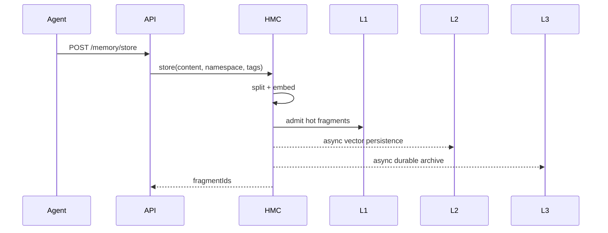
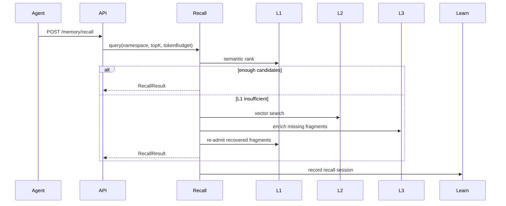

# Architecture

Vortex is organized around two kernel responsibilities:

1. Agent memory: long-context facts, preferences, observations, tool results, and recovery.
2. Agent state: task DAG, checkpoint, WAL, branch, merge, and restart recovery.

## Module View

```text
vortex-app      REST API, health endpoints, eval CLI, integration boundaries
vortex-kernel   memory controller, recall, eviction, learning, snapshot, paging
vortex-storage  L1/L2/L3 storage adapters
vortex-common   shared model, DTO, serialization, health contracts
```

## Memory Write Path



## Recall Path



## State Recovery Path

```text
validate input
append WAL
mutate in-memory task state
create checkpoint when needed
recover as FULL checkpoint -> DELTA chain -> WAL replay
```

## Observability

The health layer exposes typed diagnostic signals instead of only raw exceptions. A health report can distinguish:

- persistence failure
- L2 recall miss
- checkpoint recovery failure
- namespace isolation issue
- eviction regret
- learning signal insufficiency

